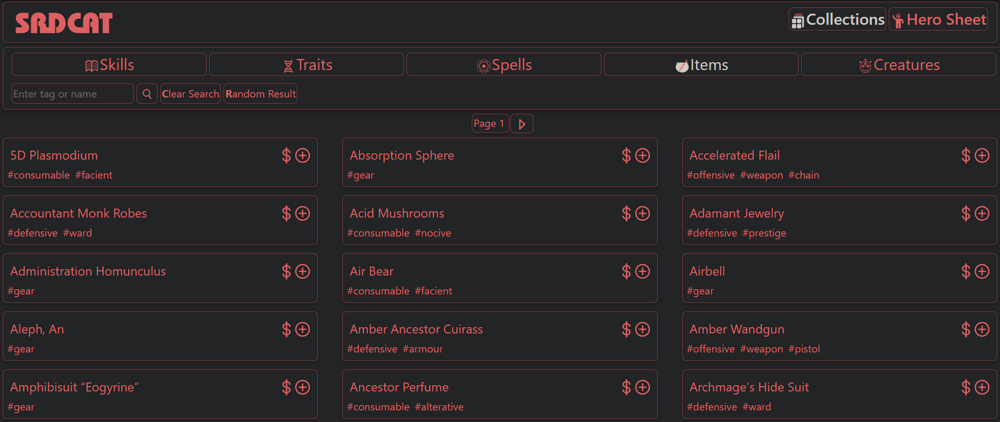
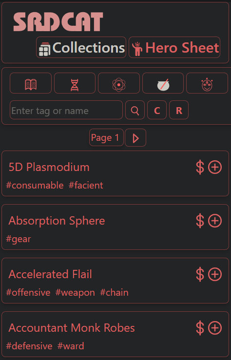
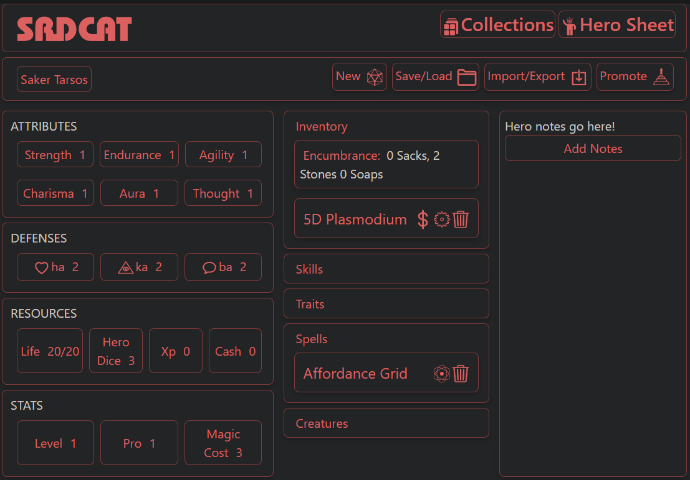
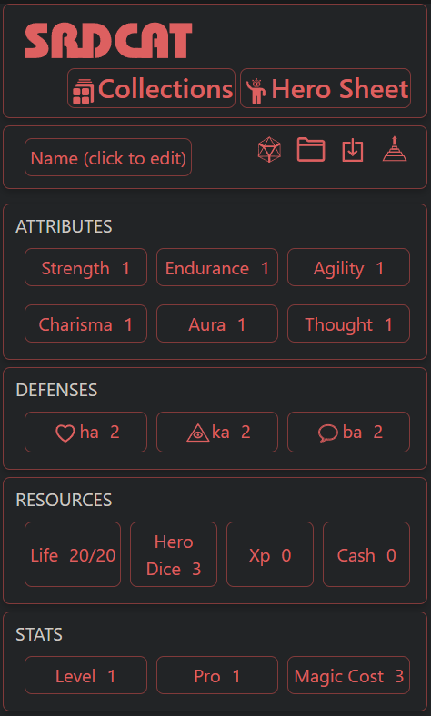

# SRDCAT - Digital System Reference Document
Randomly generate characters, perform game functions like ability checks, attack/defense rolls, casting spells, and leveling up your character. Browse a collection of over 800 in-game objects!

**Link to project:** https://srdcat.app

## How It's Made:

**Tech used:** Javascript, React, NodeJS, Bootstrap

The frontend client is built in React, running on NodeJS and styled with Bootstrap. 

The Collections page uses React component architecture to map over large lists of in-game objects. There is a custom-built search engine included that filters by keywords and tags. I've built a tag system into the in-game objects, so they can be broken down into smaller lists. The in-game objects are broken down into different item types, each with different functionality. For example, items can be bought and sold, spells can be cast, and skills/traits can be ranked up.

The Hero Sheet stores the user's character data and provides a UI so that they can perform in-game tasks, such as ability checks, spellcasting, or buying/selling items. Users can randomly generate characters at different tiers and save/load different characters from localStorage.

## Optimizations

I'm looking forward to expanding and optimizing this as time allows!
-Reduce prop drilling / clean up data passed between components
-Merge all contexts into a single "app state" context
-Refactor utility functions to increase speed / efficiency

## Lessons Learned:

This was a very rewarding and challenging project to work with. Translating game mechanics from the printed page to a web application can pose some unique challenges in software development. Some mechanics that work very simply on paper can require complex implementation in code, and my job as developer was to build an application architecture that stays true to the original game experience but is still functional programmatically. I'm looking forward to continue optimizing the efficiency of the code!

